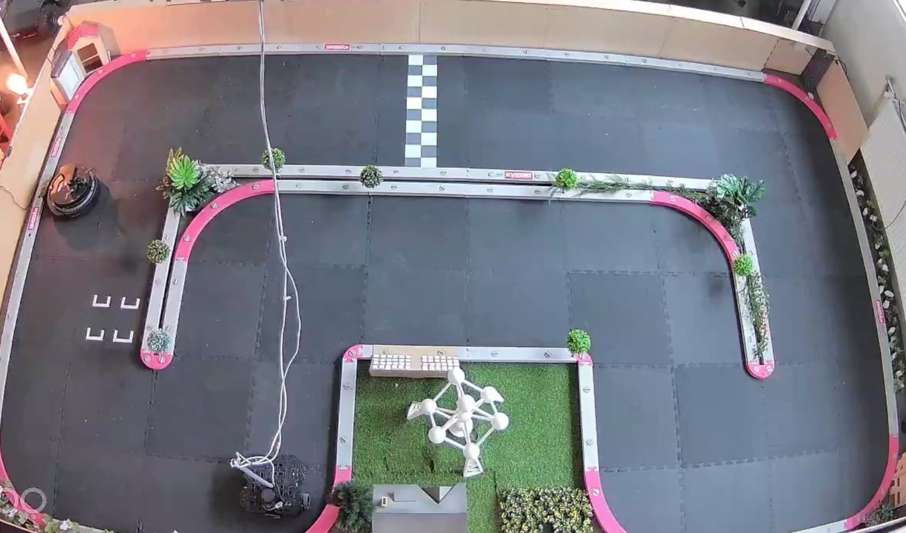

# Global Robot Localisation using Vision (ROS2 + ArUco)

Vision-based localisation system for multiple robots using overhead cameras, ArUco markers, OpenCV, ROS2, and MQTT.

> **How it works:** Two overhead cameras film the field. ArUco calibration markers (IDs 0–5) are placed at fixed positions to compute a homography — a pixel-to-world coordinate mapping. Robots carry their own ArUco markers (IDs 10+). Their positions are detected in real time and published to a cloud MQTT broker. See [`docs/architecture.md`](docs/architecture.md) for the architectual design.

---

## Hardware

- Jetson Orin Nano
- 2x USB cameras — `/dev/video4` (left), `/dev/video0` (right)
- Robots with ArUco markers (IDs 10+)
- 6 fixed calibration markers (IDs 0–5) placed at the field corners and midpoints



> See [`docs/calibration.md`](docs/calibration.md) for exact marker positions and placement instructions.

---

## Installation

### 1. Prerequisites

- Ubuntu 22.04 (on Jetson)
- ROS2 Humble installed
- Python 3.10+
- `v4l2-ctl` for camera hardware settings:

```bash
sudo apt install v4l-utils
```

- `mosquitto-clients` (optional, for MQTT debugging):

```bash
sudo apt install mosquitto-clients
```

### 2. Clone and set up virtual environment

```bash
git clone https://github.com/EnwinDang/RoboticsProject_1.git
cd RoboticsProject_1/global_localisation
python3 -m venv .venv
source .venv/bin/activate
pip install --upgrade pip
pip install opencv-contrib-python numpy paho-mqtt flask
```

### 3. Configure environment variables

Create a `.env` file in the repo root (`RoboticsProject_1/.env`):

```
FTP_HOST=ftp.botopiabe.webhosting.be
FTP_USER=dashboard@botopiabe
FTP_PASSWORD=your_ftp_password_here
FTP_REMOTE_DIR=/cams
FTP_REMOTE_NAME=camera_snapshot.jpg
MQTT_USERNAME=Robot
MQTT_PASSWORD=your_mqtt_password_here
API_KEY=your_api_key_here
```

### 4. Set up the control API as a systemd service

The control API must always be running — it handles start/stop requests from the frontend via HTTP and MQTT.

```bash
sudo nano /etc/systemd/system/control-api.service
```

Paste:
```
[Unit]
Description=Robot Control API
After=network.target

[Service]
User=jetson
WorkingDirectory=/home/jetson/RoboticsProject_1/global_localisation
ExecStart=/home/jetson/RoboticsProject_1/global_localisation/.venv/bin/python tools/control_api.py
Restart=always
RestartSec=5
Environment=PYTHONUNBUFFERED=1

[Install]
WantedBy=multi-user.target
```

Enable and start:
```bash
sudo systemctl daemon-reload
sudo systemctl enable control-api
sudo systemctl start control-api
```

> See [`docs/system_guide.md`](docs/system_guide.md) for the full HTTP and MQTT control API reference.

### 5. Set up the FTP cronjob

The FTP cronjob runs every minute and uploads a top-down snapshot of the field. It automatically skips when localisation is running.

```bash
crontab -e
```

Add:
```
* * * * * /home/jetson/RoboticsProject_1/global_localisation/.venv/bin/python /home/jetson/RoboticsProject_1/global_localisation/tools/camera_snapshot_ftp.py >> /tmp/ftp.log 2>&1
```

### 6. Configure passwordless sudo for systemctl

Required so the control API can manage system services without prompting for a password:

```bash
sudo visudo -f /etc/sudoers.d/camera-ftp
```

Add:
```
jetson ALL=(ALL) NOPASSWD: /usr/bin/systemctl start camera-ftp, /usr/bin/systemctl stop camera-ftp
```

### 7. Source ROS2 on login

```bash
echo "source /opt/ros/humble/setup.bash" >> ~/.bashrc
source ~/.bashrc
```

---

## Running the System

The control API starts automatically on boot. To start/stop localisation:

**Via HTTP:**
```bash
curl -X POST http://jetson-dang.local:8081/start -H "X-API-Key: <your-key>"
curl -X POST http://jetson-dang.local:8081/stop  -H "X-API-Key: <your-key>"
curl http://jetson-dang.local:8081/status
```

**Via MQTT:**
```bash
mosquitto_pub -h e26688c7fd4c4f238a2e04f8d12199af.s1.eu.hivemq.cloud -p 8883 \
  --insecure -u Robot -P "<password>" \
  -t "city/control" -m '{"action": "start"}'
```

> See [`docs/system_guide.md`](docs/system_guide.md) for the full frontend integration guide including MQTT topics and FTP image URL.

---

## Calibration marker layout

```
ID 0 -------- ID 2 -------- ID 4
(left top)   (mid top)   (right top)

ID 1 -------- ID 3 -------- ID 5
(left bot)   (mid bot)   (right bot)
```

Field dimensions: 6m × 3m. Each camera needs at least 4 markers visible to compute homography.

> See [`docs/calibration.md`](docs/calibration.md) for detailed placement instructions.

---

## MQTT

Robot positions published to HiveMQ cloud:

- **Topic:** `city/robots/tag{id}`
- **Broker:** `e26688c7fd4c4f238a2e04f8d12199af.s1.eu.hivemq.cloud:8883` (TLS)
- **Payload:** `{"x": 2.14, "y": 1.39, "theta": 1.57}`

> See [`docs/system_guide.md`](docs/system_guide.md) for full MQTT reference including control topic and example code.

---

## Project Structure

```
RoboticsProject_1/
├── .env                            # Credentials (not in git)
└── global_localisation/
    ├── main.py                     # Robot detection + MQTT publishing
    ├── config.py                   # All configuration
    ├── mapping/
    │   └── homography.py           # Pixel → world coordinate mapping
    └── tools/
        ├── control_api.py              # HTTP + MQTT control API (systemd service)
        ├── camera_snapshot_ftp.py      # FTP upload (cronjob, runs every minute)
        ├── camera_test.py              # Live camera debug stream
        ├── utils.py                    # Shared camera/detection utilities
        ├── aruco_generate.py           # Generate ArUco marker images
        └── generate_calibration_pdf.py # Generate printable calibration PDF
```

---

## Debugging

### View control API logs
Stream live logs from the control API service — useful to see start/stop events and errors:
```bash
sudo journalctl -u control-api -f
```

### View FTP upload logs
Shows a history of FTP uploads and whether the cronjob skipped (localisation was running):
```bash
cat /tmp/ftp.log
```

### Live camera stream
Opens a browser-accessible stream showing both camera feeds with ArUco detections overlaid. Useful for checking camera angles and marker visibility:
```bash
cd global_localisation && python tools/camera_test.py
```
SSH tunnel on Mac (required — Jetson has no display): `ssh -L 8082:localhost:8082 jetson@<ip>`
Then open `http://localhost:8082` in browser.

### Check system status
Check if the control API is running, what cronjobs are active, and whether localisation is currently running:
```bash
sudo systemctl status control-api   # is the control API up?
crontab -l                          # shows the FTP cronjob
cat /tmp/localisation.lock          # exists only when main.py is running
```

---

## Documentation

| Doc | Description |
|-----|-------------|
| [`docs/system_guide.md`](docs/system_guide.md) | Full system guide — operational flow, HTTP API, MQTT, FTP |
| [`docs/architecture.md`](docs/architecture.md) | System architecture and data flow |
| [`docs/calibration.md`](docs/calibration.md) | Calibration marker positions and setup |
